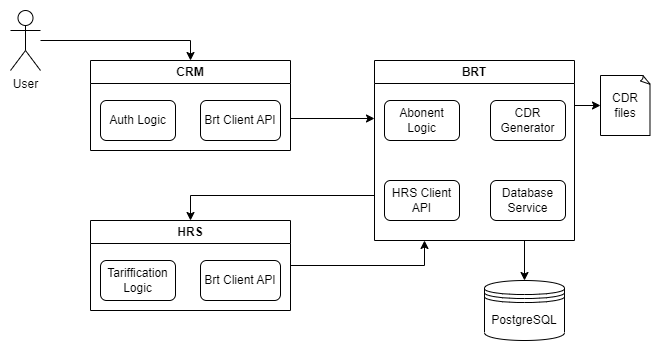

# nexignBootcampProject

## Описание задания:

Файл CDR (Call Data Record) собирается на коммутаторе - оборудовании,
обрабатывающем звонки. Этот файл содержит следующую обязательную информацию:
 * тип вызова (01 -исходящие, 02 -входящие)
 * номер абонента•дата и время начала звонка (YYYYMMDDHH24MMSS)
 * дата и время окончания звонка 

 * Вот пример готовой записи cdr:
` 02,79876543221,20230321160455,20230321163211`
 
CDR принимает BRT (Billing Real Time). Получив данные из CDR BRT авторизует абонентов оператора "Ромашка",
чей баланс больше 0. Для этого BRT связывается с базой клиентов, в которой есть информация об абоненте:
номер, тариф, баланс.

Поддерживается 4 тарифа:
* (06) Безлимит 300: 300 минут - за тарифный период стоят фиксированную сумму -100р.
Каждая последующая минута - 1р. 
* (03) Поминутный: 1 минута разговора - 1.5 рубля. 
* (11) Обычный: Входящие - бесплатно, исходящие - первые 100 минут по 0.5р/минута, после по тарифу "поминутный".
* (82) Тариф Х: Исходящие и входящие звонки абонентам оператора Ромашка - бесплатно. Всем остальным - расчет по тарифу "поминутный".

После авторизации BRT генерирует файл CDR+, который содержит уже информацию о тарифе абонента и передает его
в HRS (High performance rating server). HRS считает сколько денег нужно списать со счета абонента, исходя из длительности
его разговоров и выбранного тарифа и возвращает данные в BRT, который вносит изменения в базу и меняет баланс пользователя на соответствующую сумму.

## Особенности реализации

### Архитектура приложения:

#### Использованные технологии: 
Java 11, Spring (Boot, Data, Security, Cloud), PostgreSQL, Maven, Docker

### BRT:
Главный сервис, который отвечает за логику работы приложения. Здесь генерируются CDR файлы, создаются и изменяются абоненты.
При запуске генерируется 50 абонентов с рандомными тарифами и балансом в диапазоне [-2000; 8000] и сохраняются в базу данных.
Далее создается файл CDR на основе уже имеющихся в базе абонентов. В CDR добавлен номер собеседника (для тарификации по ТарифуХ).
На каждого абонента генерируется от 20 до 50 звонков длительностью до 1 часа (1 CDR файл - 1 месяц).
Получив CDR, сервис генерирует CDR+ (только абоненты с положительным балансом) с дополнительной информацией о тарифе, 
нужной для подсчета стоимости звонка.

### HRS:
Сервис получает CDR+ и построчно высчитывает сколько стоил каждый звонок, исходя из данных о тарифе и звонке.

### CRM:
Этот сервис можно назвать клиентским - отсюда идут запросы от клиента к другим сервисам. Есть 2 уровня прав:
менеджер и абонент
* Абонент может пополнить счет и получить детализацию **только своих** звонков
* Менеджер может сменить тариф, создать нового пользователя и выполнить тарификацию
(при новой тарификации будет сгенерирован новый месяц разговоров)

При инициализации сервиса он получает список всех номеров телефонов из базы данных (для этого он обращается к BRT) 
и создает для каждого номера своего User с паролем `123`. Также создается 1 менеджер `admin:admin`
Сервис работает на порту `9099`

### Eureka:
Сервис для регистрации всех микросервисов

### Postman коллекция:
Демонстрирует работу приложения
[Приглашение](https://app.getpostman.com/join-team?invite_code=1820a92a30889287b3e8109a72d38d4a&target_code=92b66b8b577dec47871ba48c68d29f94)
Скриншоты из Postman:

### Swagger документация:
`http://localhost:9099/swagger-ui/index.html`

